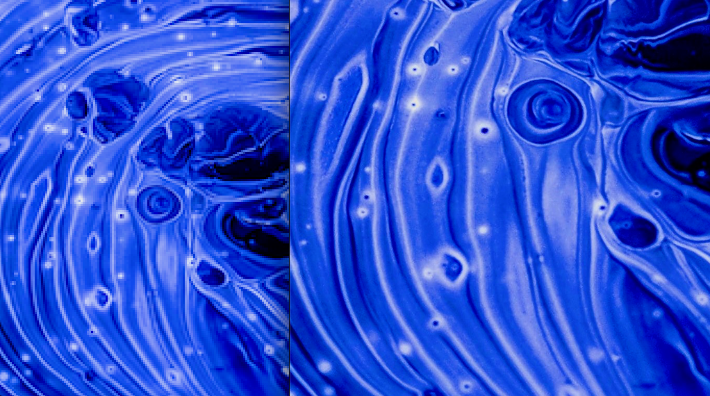
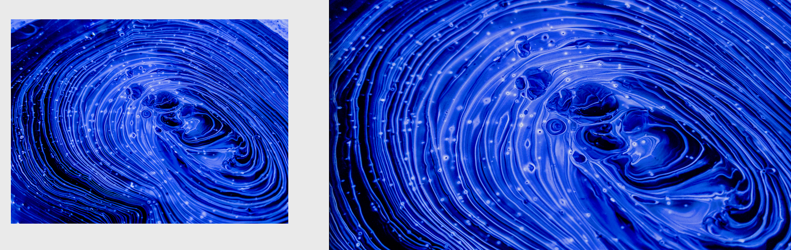
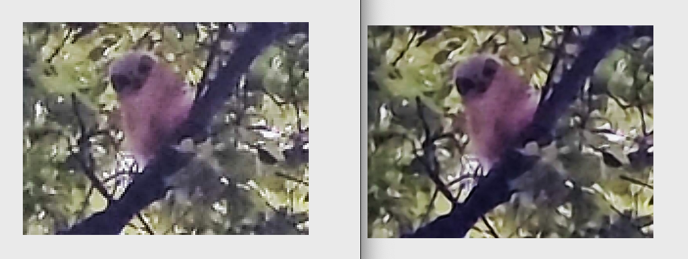
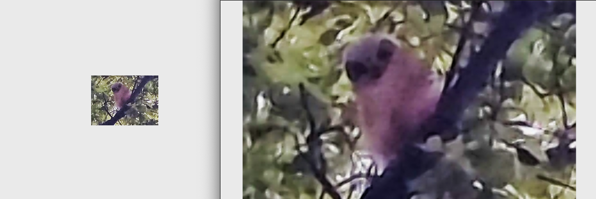

Image-Better-Upper
An app to update old, low-resolution images to modern internet expectations.

Built with Flask and using the super-resolution ESPCN model from OpenCV, this app recovers high-resolution images from the corresponding low-resolution images on input.

Demo at https://image-better-upper.mizucode.com/

Since this is intended for upgrading lower-resolution images, the max total file size is 2MB.

Here is an example of the difference in resolution:

Something to note is the image we are starting with, although small, is still sharp and detailed. This produces an ideal end result.

Here's an example of how lower-quality image fares:

